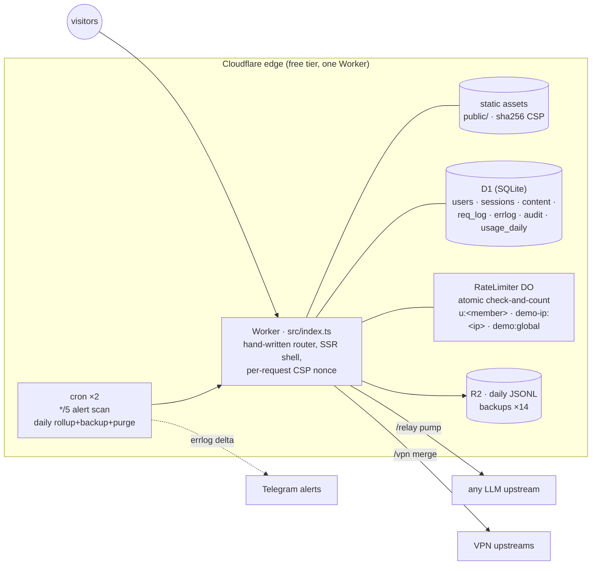

# uaip — an edge-native LLM gateway

[](https://github.com/Jhongwe1/uaip/actions/workflows/ci.yml)
[](https://uaip.cc.cd/playground)
&nbsp;Live: **<https://uaip.cc.cd>** · 繁體中文版說明：**[README.zh-TW.md](./README.zh-TW.md)**

An LLM gateway with **atomic rate limiting, per-request metering with cost accounting, and
streaming that survives a 10 ms CPU budget** — running on one Cloudflare Worker, one D1
(SQLite) database, one Durable Object class and two cron schedules. Zero framework, zero
runtime dependencies, no containers, no bundler for the runtime: `git push` is the whole
supply chain.

> **Try it right now**: [uaip.cc.cd/playground](https://uaip.cc.cd/playground) — when demo
> mode is enabled you can chat with a real model without signing in (fail-closed
> rate limits; chats are logged for the site admin only — visitors get no history).

<p align="center">
  
  
</p>

<p align="center"><sub>v2.2 UI: a ChatGPT-style shell across the whole site — persistent sidebar
(menu + chat history), header model picker, dark-first, English-first with a 中文 toggle.</sub></p>

## The gateway

Members point any AI tool at one base URL with one `uak-` key; the server swaps in the
admin's upstream credential and forwards, streaming, to OpenAI / Anthropic / Gemini /
anything OpenAI-compatible. Upstream keys never leave the server.

Three problems make this more than a proxy, and they are what the codebase is actually about:

**1. Rate limiting has to be atomic, or it isn't a limit.**
The v1 design counted rows in D1 and then inserted — two concurrent requests read the same
count and both passed. Quota enforcement now lives in a Durable Object: one instance per
member, single-threaded, with the check-and-increment inside one synchronous method body
(no `await`, so nothing can interleave). Blocked requests don't consume quota.
Verified under 200 real concurrent HTTP connections — exactly the limit passes, never one
more ([`tools/loadtest.mjs`](./tools/loadtest.mjs), numbers in
[docs/REPORT.md](./docs/REPORT.md)). [ADR-0007](./docs/adr/0007-durable-object-rate-limiter.md)

**2. Metering must not cost you the request.**
Every relay/playground call logs status, duration, TTFB and tokens; `model_prices`
(exact match, then longest-prefix) turns tokens into estimated USD per channel and per
member. The usage scan reads the **response** tail only — member request bodies are never
buffered or parsed. It uses a pump rather than `tee()` specifically so that a client
disconnect cancels the upstream read instead of letting a second reader drain a
generation nobody will see — `tee()` would keep paying for it.
[ADR-0005](./docs/adr/0005-relay-pump-metering-not-tee.md)

**3. The free plan gives you 10 ms of CPU per invocation, and exceeding it kills the
isolate silently.**
No catchable error, no `req_log` row, no `errlog` entry — replies just stopped mid-sentence
and nothing in the application could see why. Only `wrangler tail` shows it. The fix was
not "make it faster" but "stop doing work per delta": writes are batched on a 100 ms /
1 000-character threshold, and parsing uses a regex fast path that extracts the one string
we need instead of materializing a ~17-object tree per chunk — so V8 allocates one string
and the GC has nothing to collect. (GC pauses are billed to the same budget, which is why
allocation costs twice.) Reproduce it yourself: `npm run bench`.
[ADR-0011](./docs/adr/0011-streaming-cpu-budget.md)

A fourth, smaller one worth naming: **the client disconnecting shouldn't lose the reply.**
Closing the tab does not cancel a Workers response stream — `writer.write()` simply never
settles, so the request hangs until the platform kills it and takes the D1 writes with it.
Detection is a write-timeout circuit breaker, and generation continues on a budget so the
answer is complete when you come back. [ADR-0012](./docs/adr/0012-finish-reply-after-disconnect.md)

## Also on the same Worker

The gateway shares its identity, session, approval and audit layer with the rest of the
site, which is the point of running one Worker instead of four:

| | Path | |
|---|---|---|
| **Playground** | `/playground` | ChatGPT-style web chat over the same channels (v2.2 shell); conversations in D1; SSE with provider-identity sanitization. Anonymous **demo mode** is fail-closed — the deliberate inverse of the member path's fail-open quotas ([ADR-0009](./docs/adr/0009-demo-mode-fail-closed.md)). A **hidden-model lock** can pin every member to one admin-chosen model — enforced server-side, and the API masks which model it is. |
| **Content portal** | `/news` `/articles` `/p/{slug}` | SSR CMS with D1-stored images, RSS, sitemap, OG/JSON-LD, custom pages. |
| **VPN subscription** | `/vpn` | Multi-upstream merge behind one member URL; invisible to anyone without the grant unless the admin flips the public-visibility switch. |
| **Tools** | `/ip` `/ua` | The original IP/UA lookup SPA (the site root now lands on the chat). |
| **Admin** | `/settings` `/members` `/admin` `/logs` `/api-docs` | Everything the API can set, settable from the web: quotas, demo mode, hidden-model lock, VPN visibility, pricing, Telegram alerts, custom pages; member/service management; visitor + error + usage-with-cost dashboards. |

Identity: Google OAuth → HttpOnly session (sids hashed in D1). Per-service grants
(`relay` / `vpn` / `playground`); admin = env-pinned email list. Every admin mutation is
audit-logged.

## Architecture



Design decisions are recorded as ADRs — the honest trade-offs, not just the wins:

- [ADR-0001 Zero framework, zero runtime dependencies](./docs/adr/0001-zero-framework.md)
- [ADR-0002 One D1 database for everything](./docs/adr/0002-d1-only.md)
- [ADR-0003 Shared upstream keys + quotas, not BYOK](./docs/adr/0003-shared-key-quota-not-byok.md)
- [ADR-0004 CSP: per-request nonce (SSR) + sha256 (static)](./docs/adr/0004-csp-nonce-plus-hash.md)
- [ADR-0005 Relay metering via pump, not tee()](./docs/adr/0005-relay-pump-metering-not-tee.md)
- [ADR-0006 Pages → Workers migration](./docs/adr/0006-pages-to-workers.md)
- [ADR-0007 Durable Object rate limiter (atomic, fail-open)](./docs/adr/0007-durable-object-rate-limiter.md)
- [ADR-0008 Full TypeScript (strict)](./docs/adr/0008-typescript-strict.md)
- [ADR-0009 Demo mode is fail-closed — the inverse of member quotas](./docs/adr/0009-demo-mode-fail-closed.md)
- [ADR-0010 OpenAPI as a build artifact; public three-piece docs](./docs/adr/0010-openapi-three-piece-docs.md)
- [ADR-0011 Staying on the free plan — the 10 ms CPU budget for streaming](./docs/adr/0011-streaming-cpu-budget.md)
- [ADR-0012 Finishing the reply after the client disconnects](./docs/adr/0012-finish-reply-after-disconnect.md)

Also: [Production report with real numbers](./docs/REPORT.md) ·
[Security audit, two rounds + the miss rate of the first](./docs/AUDIT-2026-07.md) ·
[Threat model (STRIDE)](./docs/THREAT-MODEL.md) ·
[Honest comparison vs one-api / LiteLLM / OpenRouter / AI Gateway](./docs/COMPARISON.md) ·
[Known debt](./DEBT.md) · [Security policy](./SECURITY.md)

## Engineering evidence (v2.2.0)

- **424 unit/integration tests running inside workerd** (`@cloudflare/vitest-pool-workers`) —
  the same runtime as production: real D1, real Durable Objects, real streams, real
  `crypto.subtle`. Upstreams are mocked with `fetchMock` so tests assert *what actually got
  forwarded* (header stripping, key swapping, byte-for-byte stream fidelity, forced
  `max_tokens` in demo mode).
- **5 Playwright E2E flows** against a real browser × `wrangler dev` × a mock SSE upstream:
  admin publishes → `/news` renders; member approval → live streamed chat; anonymous `/vpn`
  invisibility; demo mode quota exhaustion → 429 surfaced in the UI; public `/api-docs`
  with the interactive OpenAPI reference actually booting under CSP.
- **Two reproducible measurement tools**, not just claims: `npm run bench` replays 5,982
  synthetic deltas and checks both parse paths emit byte-identical text *before* reporting
  timings; `npm run loadtest` spins up a mock upstream and `wrangler dev` and fires 200 real
  concurrent requests at the rate limiter.
- **Docs that fail the build when they lie.** `tools/check-docs.mjs` (CI, alongside the
  existing CSP and OpenAPI drift checks) asserts every test-count claim in the docs equals
  the number vitest actually ran, that the E2E-flow count matches, that version strings
  agree across `package.json` / `lib/site.ts` / README, and that the comparison table
  still describes a Worker rather than the retired Pages setup. This exists because a July
  2026 audit found *three contradicting test counts* in one repo — and the first attempt at
  the check counted `it(` in the source, which silently undercounts loop-generated tests
  and passed while the README was wrong. It now reads `numTotalTests` from the run.
- **The v2.2 UI is hand-written too** — no React, no Tailwind, no build step for the client.
  The whole ChatGPT-style shell and chat surface (collapsible sidebar, chat history with
  per-row menus, shared popover system, streaming markdown, dark/light × en/zh) is under
  300 lines of CSS and under 1,000 lines of dependency-free JavaScript, served inline under
  a per-request CSP nonce — so "zero runtime dependencies" survived a full visual redesign
  instead of quietly acquiring a framework.
- **CI** (GitHub Actions): ESLint + Prettier drift → typecheck → tests → apidoc/openapi/CSP
  drift checks → E2E → gitleaks. Deploys stay local by design (`npm run deploy`).
- **Failure-policy engineering**: member quotas are fail-open in three layers
  (DO → D1 count → allow) because availability for approved humans wins; anonymous demo
  is **fail-closed** (DO down → 503) because unmetered strangers lose. Same DO, opposite
  policies, policy lives in the caller.
- **Operational hygiene on the free tier**: daily JSONL backup of every table to R2
  (14 retained), daily `usage_daily` rollup (aggregates outlive the 90-day raw retention),
  expired-session/old-log purge, 5-minute errlog → Telegram alert scan — each job isolated,
  self-reporting (`settings.cron_last_*`), and its failures feed the very alert channel
  that watches everything else.
- **API documented three ways** (narrative `API.md`, hand-written `docs/openapi.yaml`,
  generated modules) with CI enforcing route-table × spec bidirectional equality — adding
  an endpoint without documenting it is a red build.

## Repository layout

```
src/              the Worker (TypeScript, strict): entry + hand-written router + cron
  src/routes/     route handlers: APIs, SSR pages, relay engine, middleware
  src/lib/        shared server code (site shell, auth, quota, cost, demo, observe, …)
  src/do/         RateLimiter Durable Object (SQLite-backed, atomic)
public/           static assets (SPA + client scripts + vendored Scalar + _headers CSP)
migrations/       D1 schema, the only source of truth
test/             vitest-pool-workers suites (unit + integration)
e2e/              Playwright flows (real browser × wrangler dev × mock upstream)
tools/            bench-sse / loadtest / build-apidoc / build-openapi / check-csp / seeds
docs/             ADRs, threat model, audit, comparison, production report, openapi.yaml
API.md            narrative API reference (source of the live /api-docs page)
AGENTS.md         operating guide for AI agents
ADMIN.md          maintainer notes (secrets live in gitignored ADMIN.local.md)
```

## Develop / test / deploy

```bash
npm ci                    # dev toolchain — the runtime itself has zero dependencies
cp .dev.vars.example .dev.vars   # local dev flags (never uploaded by wrangler deploy)
npm run migrate:local     # create local D1 from migrations/
npm run seed              # optional: local admin/member/channel seed
npm run dev               # http://localhost:8787
npm run checks            # eslint + typecheck + tests
npm run e2e               # Playwright (spins up mock upstream + wrangler dev itself)
npm run bench             # reproduce the ADR-0011 CPU numbers
npm run loadtest          # 200 concurrent requests at the rate limiter DO
npm run deploy            # rebuild apidoc + openapi, then wrangler deploy
npm run migrate:remote    # apply new migrations to production (run BEFORE deploy)
```

`DEV_UNSAFE_ADMIN=1` in `.dev.vars` is what opens the local-only conveniences (admin
endpoints without `LOGS_TOKEN`, and the test-login form). It is an **explicit flag, not an
inferred environment** — until July 2026 that gate read the `Host` header, which is
client-controlled; see [docs/AUDIT-2026-07.md](./docs/AUDIT-2026-07.md) §1.9.

First-time setup (Cloudflare login, Google OAuth secrets, admin emails, R2 bucket,
optional Telegram alerts — also configurable from the `/settings` admin page): see
[ADMIN.md](./ADMIN.md). Quick API tour (publish a post, create a page, wire the menu):
see [API.md](./API.md) — served live at
[`/api-docs`](https://uaip.cc.cd/api-docs) with an interactive OpenAPI reference,
spec at [`/openapi.json`](https://uaip.cc.cd/openapi.json).

## License

[MIT](./LICENSE).

---

*Personal project of a single maintainer; the repo doubles as its own case study.*
