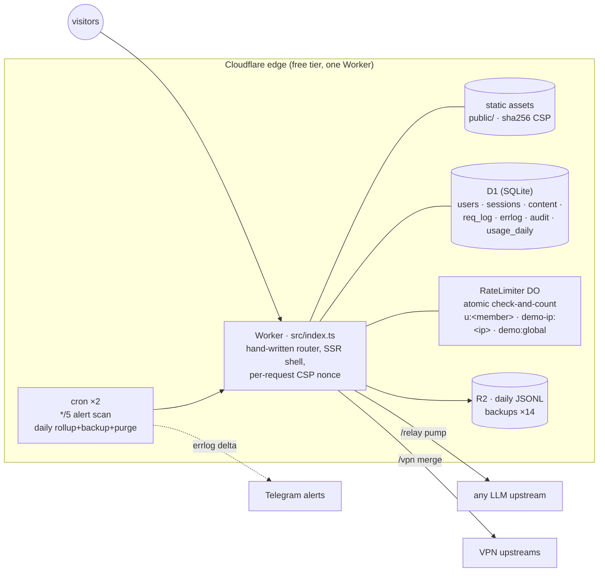

# uaip — an edge-native LLM gateway & personal portal

[](https://github.com/Jhongwe1/uaip/actions/workflows/ci.yml)
[](https://uaip.cc.cd/playground)
&nbsp;Live: **<https://uaip.cc.cd>** · 繁體中文版說明：**[README.zh-TW.md](./README.zh-TW.md)**

A single-maintainer engineering case study: a **zero-framework, zero-runtime-dependency
LLM gateway with member management, atomic rate limiting, metering with cost accounting,
automated backups/alerting, and a full content portal** — running entirely on one Cloudflare
Worker, one D1 (SQLite) database, one Durable Object class and two cron schedules.
No servers, no containers, no bundler for the runtime — `git push` is the whole supply chain.

> **Try it right now**: [uaip.cc.cd/playground](https://uaip.cc.cd/playground) — when demo
> mode is enabled you can chat with a real model without signing in (fail-closed
> rate limits, nothing you type is stored server-side).

<p align="center">
  
  
</p>

## What it does

| Service | Path | Notes |
|---|---|---|
| **LLM gateway (relay)** | `/relay/{channel}/…` | Members use one `uak-` key + one base URL for any upstream (OpenAI / Anthropic / Gemini / self-hosted). Upstream keys never leave the server. Streaming passthrough; per-user daily quotas + sliding-window rate limits enforced **atomically in a Durable Object**; token/latency metering scanned from the **response** stream only. |
| **LLM playground** | `/playground` | Web chat over the same channels; conversations persisted in D1; SSE streaming with provider-identity sanitization. **Public demo mode**: anonymous visitors get a locked-down, fail-closed-limited taste without an account. |
| **VPN subscription** | `/vpn` | Multi-upstream merge behind one member URL. **Invisible** to anyone not granted the service (menu, page, and API fields all hide). |
| **Content portal** | `/news` `/articles` `/p/{slug}` | SSR news/article CMS with D1-stored images, RSS, sitemap, OG/JSON-LD; custom pages creatable via API or the /settings admin page. |
| **Tools** | `/` `/ip` `/ua` | The original IP/UA lookup SPA. |
| **Admin** | `/settings` `/members` `/admin` `/logs` `/api-docs` | Admin settings page (site name, quotas, demo mode, Telegram alerts, model pricing, custom pages — everything the API can set, settable from the web), member/service/quota management, article CMS, visitor + error + usage-with-cost dashboards, public API docs (narrative + interactive OpenAPI). |

Identity: Google OAuth → HttpOnly session (hashed sids). Per-service grants (`relay` / `vpn` /
`playground`) per member; admin = env-pinned email list. Everything admin-mutable is audit-logged.

## Architecture



Design decisions are recorded as ADRs — the honest trade-offs, not just the wins:

- [ADR-0001 Zero framework, zero runtime dependencies](./docs/adr/0001-zero-framework.md)
- [ADR-0002 One D1 database for everything](./docs/adr/0002-d1-only.md)
- [ADR-0003 Shared upstream keys + quotas, not BYOK](./docs/adr/0003-shared-key-quota-not-byok.md)
- [ADR-0004 CSP: per-request nonce (SSR) + sha256 (static)](./docs/adr/0004-csp-nonce-plus-hash.md)
- [ADR-0005 Relay metering via pump, not tee()](./docs/adr/0005-relay-pump-metering-not-tee.md)
- [ADR-0006 Pages → Workers migration](./docs/adr/0006-pages-to-workers.md)
- [ADR-0007 Durable Object rate limiter (atomic, fail-open)](./docs/adr/0007-durable-object-rate-limiter.md)
- [ADR-0008 Full TypeScript (strict)](./docs/adr/0008-typescript-strict.md)
- [ADR-0009 Demo mode is fail-closed — the inverse of member quotas](./docs/adr/0009-demo-mode-fail-closed.md)
- [ADR-0010 OpenAPI as a build artifact; public three-piece docs](./docs/adr/0010-openapi-three-piece-docs.md)
- [ADR-0011 Staying on the free plan — the 10 ms CPU budget for streaming](./docs/adr/0011-streaming-cpu-budget.md)

Also: [Production report with real numbers](./docs/REPORT.md) ·
[Threat model (STRIDE)](./docs/THREAT-MODEL.md) ·
[Honest comparison vs one-api / LiteLLM / OpenRouter / AI Gateway](./docs/COMPARISON.md) ·
[Known debt](./DEBT.md) · [Security policy](./SECURITY.md)

## Engineering evidence (v2.0.0)

- **321 unit/integration tests running inside workerd** (`@cloudflare/vitest-pool-workers`) —
  the same runtime as production: real D1, real Durable Objects (`Promise.all` concurrency
  tests pin "exactly `limit` requests pass"), real streams, real `crypto.subtle`. Upstreams
  are mocked with `fetchMock` so tests assert *what actually got forwarded* (header
  stripping, key swapping, byte-for-byte stream fidelity, forced `max_tokens` in demo mode).
- **5 Playwright E2E flows** against a real browser × `wrangler dev` × a mock SSE upstream:
  admin publishes → `/news` renders; member approval → live streamed chat; anonymous `/vpn`
  invisibility; demo mode quota exhaustion → 429 surfaced in the UI; public `/api-docs`
  with the interactive OpenAPI reference actually booting under CSP.
- **CI** (GitHub Actions): ESLint + Prettier drift → typecheck → tests → apidoc/openapi/CSP
  drift checks → E2E → gitleaks. Deploys stay local by design (`npm run deploy`).
- **Failure-policy engineering**: member quotas are fail-open in three layers
  (DO → D1 count → allow) because availability for approved humans wins; anonymous demo
  is **fail-closed** (DO down → 503) because unmetered strangers lose. Same DO, opposite
  policies, policy lives in the caller.
- **Operational hygiene on the free tier**: daily JSONL backup of every table to R2
  (14 retained), daily `usage_daily` rollup (aggregates outlive the 90-day raw retention),
  expired-session/old-log purge, 5-minute errlog → Telegram alert scan — each job isolated,
  self-reporting (`settings.cron_last_*`), and its failures feed the very alert channel
  that watches everything else.
- **Docs that can't rot**: API surface documented three ways (narrative `API.md`,
  hand-written `docs/openapi.yaml`, generated modules) with CI enforcing route-table ×
  spec bidirectional equality — adding an endpoint without documenting it is a red build.
- **Metering → money**: every relay/playground request logs status/duration/TTFB/tokens;
  `model_prices` (exact > longest-prefix patterns) turns tokens into estimated USD in the
  dashboards, per channel and per member. Real numbers: [docs/REPORT.md](./docs/REPORT.md).

## Repository layout

```
src/              the Worker (TypeScript, strict): entry + hand-written router + cron
  src/routes/     route handlers: APIs, SSR pages, relay engine, middleware
  src/lib/        shared server code (site shell, auth, quota, cost, demo, observe, …)
  src/do/         RateLimiter Durable Object (SQLite-backed, atomic)
public/           static assets (SPA + client scripts + vendored Scalar + _headers CSP)
migrations/       D1 schema, the only source of truth
test/             vitest-pool-workers suites (321 unit + integration)
e2e/              Playwright flows (real browser × wrangler dev × mock upstream)
tools/            build-apidoc / build-openapi / check-csp / seeds / mock-upstream
docs/             ADRs, threat model, comparison, production report, openapi.yaml
API.md            narrative API reference (source of the live /api-docs page)
AGENTS.md         operating guide for AI agents
ADMIN.md          maintainer notes (secrets live in gitignored ADMIN.local.md)
```

## Develop / test / deploy

```bash
npm ci                    # dev toolchain — the runtime itself has zero dependencies
npm run migrate:local     # create local D1 from migrations/
npm run seed              # optional: local admin/member/channel seed
npm run dev               # http://localhost:8787 (admin APIs need no token on localhost)
npm run checks            # eslint + typecheck + 321 tests
npm run e2e               # Playwright (spins up mock upstream + wrangler dev itself)
npm run deploy            # rebuild apidoc + openapi, then wrangler deploy
npm run migrate:remote    # apply new migrations to production (run BEFORE deploy)
```

First-time setup (Cloudflare login, Google OAuth secrets, admin emails, R2 bucket,
optional Telegram alerts — also configurable from the `/settings` admin page): see [ADMIN.md](./ADMIN.md). Quick API tour (publish a post,
create a page, wire the menu): see [API.md](./API.md) — served live at
[`/api-docs`](https://uaip.cc.cd/api-docs) with an interactive OpenAPI reference,
spec at [`/openapi.json`](https://uaip.cc.cd/openapi.json).

## License

[MIT](./LICENSE).

---

*Personal project of a single maintainer; the repo doubles as its own case study.*
