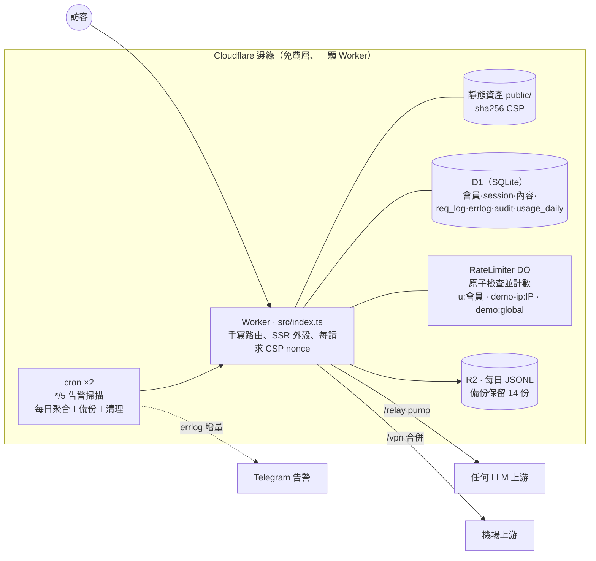

# uaip — edge-native LLM 中轉站

[](https://github.com/Jhongwe1/uaip/actions/workflows/ci.yml)
[](https://uaip.cc.cd/playground)
&nbsp;線上：**<https://uaip.cc.cd>** · English: **[README.md](./README.md)**

一個 LLM 中轉站，重點在**原子限流、逐請求計量與成本記帳，以及在 10ms CPU 預算下活下來的
串流** — 全部跑在**一顆 Cloudflare Worker、一顆 D1（SQLite）、一個 Durable Object 類別、
兩條 cron** 上。零框架、執行期零依賴、沒有容器、執行期不用打包 —— `git push` 就是整條供應鏈。

> **現在就能試**：[uaip.cc.cd/playground](https://uaip.cc.cd/playground) — 體驗模式開啟時
> 不用註冊就能跟真模型聊（fail-closed 限流；對話只留給站長看，訪客這邊沒有歷史紀錄）。

<p align="center">
  
  
</p>

<p align="center"><sub>v2.2 UI：全站 ChatGPT 風格外殼 — 常駐側邊欄（選單＋聊天紀錄）、
頁首模型選單、預設深色、預設英文（可切中文）。</sub></p>

## 中轉站本體

會員把任何 AI 工具的 base URL 換成一個網址、金鑰填自己那把 `uak-`，伺服器換上站長存的
上游憑證後原樣轉發（含串流）到 OpenAI／Anthropic／Gemini／任何 OpenAI 相容服務。
上游金鑰永遠不離開伺服器。

有三個問題讓這件事不只是「一個 proxy」，而它們才是這份程式碼真正在講的東西：

**1. 限流不原子，就不叫限流。**
v1 的作法是「COUNT 一下 req_log，沒超標就放行」—— 兩個併發請求讀到同一個計數，雙雙通過。
配額執法現在住在 Durable Object 裡：每個會員一顆實例、單執行緒，而「檢查＋計數」在同一個
同步方法體內完成（中途沒有 `await`，所以不可能交錯）。被擋下的請求不吃額度。
用 200 條真的併發 HTTP 連線驗過 —— 恰好 limit 個通過，一個都不會多
（[`tools/loadtest.mjs`](./tools/loadtest.mjs)，數字在 [docs/REPORT.md](./docs/REPORT.md)）。
[ADR-0007](./docs/adr/0007-durable-object-rate-limiter.md)

**2. 計量不能反過來害你賠上那個請求。**
每次中轉／playground 呼叫都記狀態、耗時、TTFB 與 token；`model_prices`（精確比對 →
最長前綴）把 token 換算成估算美元，按渠道與會員分列。用量掃描**只讀回應的尾端**——
會員的請求本體從不緩衝、從不解析。而且刻意用 pump 而不是 `tee()`：客戶端斷線時 pump
當場 cancel 上游，`tee()` 的另一支卻會把整段生成讀完 —— 沒有人會看到，但錢照燒。
[ADR-0005](./docs/adr/0005-relay-pump-metering-not-tee.md)

**3. 免費方案每次呼叫只有 10ms CPU，超過的話 isolate 會被靜默砍掉。**
不是可以 catch 的錯誤，沒有 `req_log`、沒有 `errlog` —— 回覆就是講到一半停住，
而應用層裡沒有任何東西看得到原因，只有 `wrangler tail` 顯示得出來。解法不是「寫快一點」，
而是**不要對每一筆增量做事**：寫入端改成 100ms／1000 字的批次門檻；解析端改用正則
直接抽出我們要的那一個字串，而不是為每個 chunk 建出約 17 個物件的樹 —— V8 只配置一個
字串，GC 沒有東西要收（GC 暫停算進同一份預算，所以配置成本是被計費兩次的）。
自己跑一次：`npm run bench`。[ADR-0011](./docs/adr/0011-streaming-cpu-budget.md)

還有第四個小一點但值得一提的：**客戶端關掉網頁，不該把回覆弄丟。**
關掉分頁**不會**讓 Workers 取消這條回應串流 —— `writer.write()` 只是永遠不 settle，
於是請求一路卡到被平台砍掉，順便把 D1 寫入一起帶走。偵測改成「寫入逾時」當死鎖斷路器，
生成則在預算內繼續跑完，下次打開就看得到完整回覆。
[ADR-0012](./docs/adr/0012-finish-reply-after-disconnect.md)

## 同一顆 Worker 上還跑了什麼

中轉站跟站上其他東西共用同一套身分、session、批准與稽核層 —— 這正是「跑一顆 Worker
而不是四顆」的理由：

| | 路徑 | |
|---|---|---|
| **Playground** | `/playground` | ChatGPT 風格網頁聊天（v2.2 外殼、同一批渠道）；對話存 D1；SSE 串流、上游身分淨化。匿名**體驗模式**是 fail-closed —— 與會員路徑 fail-open 的配額刻意相反（[ADR-0009](./docs/adr/0009-demo-mode-fail-closed.md)）。另有**單一隱藏模型鎖定**：把所有會員鎖在站長指定的一個模型 — 伺服器端強制，API 也遮掉那是哪個模型。 |
| **內容門戶** | `/news` `/articles` `/p/{slug}` | SSR 新聞／文章系統：圖片存 D1、RSS、sitemap、OG/JSON-LD、自訂頁面。 |
| **VPN 訂閱** | `/vpn` | 多上游合併成一條會員網址；沒有這項權限的人連它存在都看不到（站長可用開關改成對外展示）。 |
| **工具** | `/ip` `/ua` | 最早的 IP／UA 查詢 SPA（根網址現在直接進聊天）。 |
| **管理** | `/settings` `/members` `/admin` `/logs` `/api-docs` | API 能設的，網頁全能設：配額、體驗模式、隱藏模型鎖定、VPN 展示、定價、Telegram 告警、自訂頁面；會員／服務管理；訪客＋錯誤＋用量（含成本）儀表板。 |

身分：Google OAuth → HttpOnly session（sid 只存雜湊）。每個會員可**分服務批准**
（relay／vpn／playground）；管理員＝環境變數欽定的信箱清單。所有管理變更都寫稽核日誌。

## 架構



## 設計裁決（ADR，誠實記錄取捨）

- [ADR-0001 零框架、執行期零依賴](./docs/adr/0001-zero-framework.md)
- [ADR-0002 一顆 D1 打天下](./docs/adr/0002-d1-only.md)
- [ADR-0003 共享上游金鑰＋配額，而非 BYOK](./docs/adr/0003-shared-key-quota-not-byok.md)
- [ADR-0004 CSP：SSR 用 per-request nonce＋靜態用 sha256](./docs/adr/0004-csp-nonce-plus-hash.md)
- [ADR-0005 中轉計量用 pump 而非 tee()](./docs/adr/0005-relay-pump-metering-not-tee.md)
- [ADR-0006 Pages → Workers 遷移](./docs/adr/0006-pages-to-workers.md)
- [ADR-0007 DO 限流器（原子、fail-open）](./docs/adr/0007-durable-object-rate-limiter.md)
- [ADR-0008 全面 TypeScript（strict）](./docs/adr/0008-typescript-strict.md)
- [ADR-0009 體驗模式 fail-closed — 與會員配額刻意相反](./docs/adr/0009-demo-mode-fail-closed.md)
- [ADR-0010 OpenAPI 是建置產物；文件公開三件套](./docs/adr/0010-openapi-three-piece-docs.md)
- [ADR-0011 為了續用免費方案 — 串流的 10ms CPU 預算](./docs/adr/0011-streaming-cpu-budget.md)
- [ADR-0012 斷線後把回覆跑完再存](./docs/adr/0012-finish-reply-after-disconnect.md)

另見：[真實數據報告](./docs/REPORT.md) ·
[安全稽核：兩輪，以及第一輪的漏檢率](./docs/AUDIT-2026-07.md) ·
[威脅模型（STRIDE）](./docs/THREAT-MODEL.md) ·
[與 one-api／LiteLLM／OpenRouter／AI Gateway 的誠實對照](./docs/COMPARISON.md) ·
[已知債務](./DEBT.md) · [安全政策](./SECURITY.md)

## 工程證據（v2.2.0）

- **424 個單元／整合測試跑在 workerd 裡**（`@cloudflare/vitest-pool-workers`）— 跟正式站
  同一顆 runtime：真的 D1、真的 Durable Object、真的串流、真的 `crypto.subtle`。
  上游用 fetchMock 攔截，斷言「上游實際收到什麼」（標頭剝除、金鑰置換、串流位元組保真、
  demo 模式強制 max_tokens）。
- **5 條 Playwright E2E**：真瀏覽器 × `wrangler dev` × mock SSE 上游 — 管理員發文→/news、
  會員批准→真串流聊天、匿名 /vpn 隱形、demo 打滿→UI 顯示 429、公開 /api-docs 的
  互動式 OpenAPI 在 CSP 下真的起得來。
- **兩支可重現的量測工具**，不是只有宣稱：`npm run bench` 重播 5982 筆合成增量，
  **先驗兩條解析路徑輸出逐字相同**才報時間；`npm run loadtest` 自己起 mock 上游與
  `wrangler dev`，對限流器打 200 條真併發。
- **會讓 CI 紅燈的文件**：`tools/check-docs.mjs`（CI 裡跟既有的 CSP／OpenAPI 防漂移檢查並列）
  斷言文件裡每一個測試數字都等於 vitest **實際跑出來**的條數、E2E 條數對得上、
  `package.json`／`lib/site.ts`／README 的版本一致、對照表描述的仍是 Worker 而非已退役的 Pages。
  由來是 2026-07 稽核在同一個 repo 裡找到**三個互相矛盾的測試數字**——而第一版檢查是靜態數
  原始碼裡的 `it(`，數不到迴圈產生的測試，於是在 README 寫錯的情況下自己綠燈通過。
  現在改成直接讀該次執行的 `numTotalTests`。
- **v2.2 的 UI 一樣是手寫的** — 沒有 React、沒有 Tailwind、客戶端沒有打包步驟。
  整套 ChatGPT 風格外殼與聊天介面（可收合側邊欄、帶每列選單的對話紀錄、共用彈出選單、
  串流 Markdown、深淺色 × 中英）是**不到 300 行 CSS 與不到 1000 行零依賴 JavaScript**，
  內嵌在頁面裡吃 per-request CSP nonce —— 「執行期零依賴」這句話撐過了一次整站改版，
  而不是默默長出一個框架。
- **CI**：ESLint＋Prettier 防漂移 → typecheck → 測試 → apidoc/openapi/CSP 防漂移 →
  E2E → gitleaks。部署刻意留在本機（`npm run deploy`）。
- **失效策略工程**：會員配額三層 fail-open（DO→D1 COUNT→放行）— 已批准的熟人以可用性優先；
  匿名 demo 反過來 **fail-closed**（DO 壞→503）— 陌生流量絕不白嫖。同一顆 DO、相反策略，
  策略住在呼叫端。
- **免費層的運維紀律**：每日全庫 JSONL 備份進 R2（保留 14 份）、每日 usage_daily 聚合
  （聚合比 90 天原始資料活得久）、過期 session／舊日誌清理、每 5 分鐘 errlog→Telegram
  告警掃描 — 每個 job 隔離、自我回報（`settings.cron_last_*`），job 自己壞了也會進告警。
- **API 三件套**（敘事 API.md＋手寫 openapi.yaml＋自動產生模組），CI 強制
  「路由表 × 規格」雙向相等 — 加端點不補文件直接紅燈。

## 開發／測試／部署

```bash
npm ci                    # 開發工具鏈 — 執行期依然零依賴
cp .dev.vars.example .dev.vars   # 本機開發旗標（wrangler deploy 永遠不會上傳它）
npm run migrate:local     # 從 migrations/ 建本機 D1
npm run seed              # 選用：本機種子（管理員＋會員＋示範渠道）
npm run dev               # http://localhost:8787
npm run checks            # eslint＋typecheck＋測試
npm run e2e               # Playwright（自己起 mock 上游＋wrangler dev）
npm run bench             # 重現 ADR-0011 的 CPU 數字
npm run loadtest          # 對限流器 DO 打 200 條真併發
npm run deploy            # 重建 apidoc＋openapi，然後 wrangler deploy
npm run migrate:remote    # 正式庫套新 migration（要在 deploy 之前跑）
```

`.dev.vars` 裡的 `DEV_UNSAFE_ADMIN=1` 才是打開本機便利功能的東西（免 `LOGS_TOKEN` 的管理端點、
測試登入表單）。它是**明示的旗標，不是「猜出來的環境」**—— 2026-07 之前這道閘看的是
`Host` 標頭，而那是客戶端可控的，見 [docs/AUDIT-2026-07.md](./docs/AUDIT-2026-07.md) §1.9。

首次設定（Cloudflare 登入、Google OAuth 憑證、管理員信箱、R2 備份桶、Telegram 告警 — 告警也能直接在 /settings 管理頁設定）
見 [ADMIN.md](./ADMIN.md)。API 快速上手（發文、開頁面、掛選單）見 [API.md](./API.md) —
線上版在 [`/api-docs`](https://uaip.cc.cd/api-docs)（含互動式 OpenAPI 參考，
規格在 [`/openapi.json`](https://uaip.cc.cd/openapi.json)）。

## 文件地圖

| 文件 | 內容 |
|---|---|
| [API.md](./API.md) | **完整 API 文件**：所有端點、參數、欄位規則、curl 範例（線上 /api-docs 的原稿） |
| [docs/openapi.yaml](./docs/openapi.yaml) | 機器可讀的 OpenAPI 3.1 規格（線上 `/openapi.json`） |
| [docs/AUDIT-2026-07.md](./docs/AUDIT-2026-07.md) | 2026-07 安全稽核：兩輪、方法論改動，以及第一輪的漏檢率 |
| [AGENTS.md](./AGENTS.md) | **給 AI agent 的操作指南**：金鑰在哪、照抄流程、驗證清單 |
| [ADMIN.md](./ADMIN.md) | 管理員維護筆記：部署眉角、資料庫維護、備份與告警（金鑰明文只在 gitignored 的 ADMIN.local.md） |
| [DEBT.md](./DEBT.md) | 已知債務與門檻（何時該還；還掉劃線留紀錄） |
| `.claude/skills/uaip-api/` | Claude Code skill 入口（薄殼，指向 AGENTS.md 與 API.md） |

## 授權

[MIT](./LICENSE)。

---

*個人專案，repo 同時是自己的工程案例研究。*
