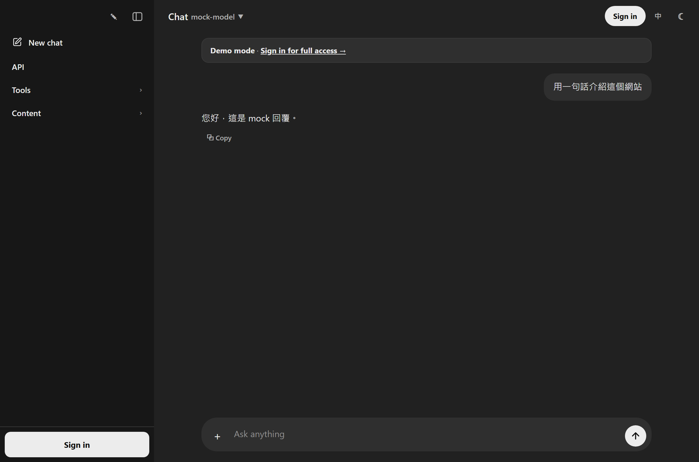
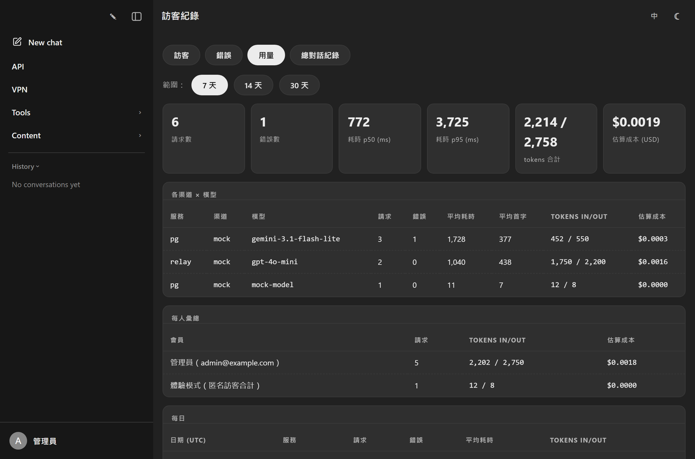
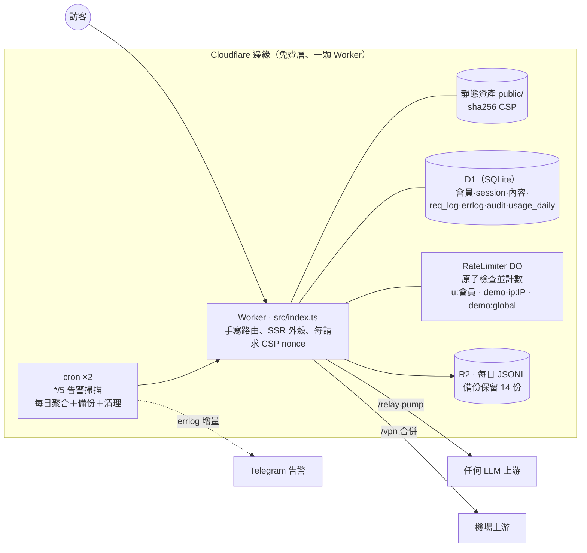

# uaip — edge-native LLM 中轉站＋個人門戶

[](https://github.com/Jhongwe1/uaip/actions/workflows/ci.yml)
[](https://uaip.cc.cd/playground)
&nbsp;線上：**<https://uaip.cc.cd>** · English: **[README.md](./README.md)**

單人維護的工程案例：**零框架、執行期零依賴**的 LLM 中轉站＋會員系統＋原子限流＋
計量與成本記帳＋自動備份告警＋完整內容門戶 — 全部跑在**一顆 Cloudflare Worker、
一顆 D1（SQLite）、一個 Durable Object 類別、兩條 cron**上。沒有伺服器、沒有容器、
執行期不用打包 — `git push` 就是整條供應鏈。

> **現在就能試**：[uaip.cc.cd/playground](https://uaip.cc.cd/playground) — 體驗模式開啟時
> 不用註冊就能跟真模型聊（fail-closed 限流、你打的字不會存伺服器）。

<p align="center">
  
  
</p>

## 功能一覽

| 服務 | 路徑 | 說明 |
|---|---|---|
| **API 中轉站** | `/relay/{渠道}/…` | 會員一把 `uak-` 金鑰＋一個網址接上任何上游（OpenAI／Anthropic／Gemini／自架）。上游金鑰永遠不離開伺服器。串流直通；每人每日配額＋滑動窗限流在 **Durable Object 裡原子執法**；只從**回應**串流掃 token／延遲計量。 |
| **LLM Playground** | `/playground` | 網頁聊天（同一批渠道）；對話存 D1；SSE 串流、上游錯誤對會員淨化。**公開體驗模式**：匿名訪客免帳號可試聊（鎖渠道模型、fail-closed 限流）。 |
| **VPN 訂閱** | `/vpn` | 多上游合併成一條會員網址。未被批准的人**完全看不到它的存在**（選單、頁面、API 欄位全隱形）。 |
| **內容門戶** | `/news` `/articles` `/p/{slug}` | SSR 新聞／文章系統（圖片存 D1、RSS、sitemap、OG/JSON-LD）；自訂頁面用 API 或 /settings 網頁就能開。 |
| **工具** | `/` `/ip` `/ua` | 最早的 IP／UA 查詢 SPA。 |
| **管理** | `/settings` `/members` `/admin` `/logs` `/api-docs` | 管理員設定頁（站名、配額、體驗模式、Telegram 告警、模型定價、自訂頁面 — API 能設的網頁全能設）、會員／服務／配額管理、文章後台、訪客＋錯誤＋用量（含成本）儀表板、公開 API 文件（敘事＋互動式 OpenAPI）。 |

身分：Google OAuth → HttpOnly session（sid 只存雜湊）。每個會員可**分服務批准**
（relay／vpn／playground）；管理員＝環境變數欽定的信箱清單。所有管理變更都寫稽核日誌。

## 架構



## 設計裁決（ADR，誠實記錄取捨）

- [ADR-0001 零框架、執行期零依賴](./docs/adr/0001-zero-framework.md)
- [ADR-0002 一顆 D1 打天下](./docs/adr/0002-d1-only.md)
- [ADR-0003 共享上游金鑰＋配額，而非 BYOK](./docs/adr/0003-shared-key-quota-not-byok.md)
- [ADR-0004 CSP：SSR 用 per-request nonce＋靜態用 sha256](./docs/adr/0004-csp-nonce-plus-hash.md)
- [ADR-0005 中轉計量用 pump 而非 tee()](./docs/adr/0005-relay-pump-metering-not-tee.md)
- [ADR-0006 Pages → Workers 遷移](./docs/adr/0006-pages-to-workers.md)
- [ADR-0007 DO 限流器（原子、fail-open）](./docs/adr/0007-durable-object-rate-limiter.md)
- [ADR-0008 全面 TypeScript（strict）](./docs/adr/0008-typescript-strict.md)
- [ADR-0009 體驗模式 fail-closed — 與會員配額刻意相反](./docs/adr/0009-demo-mode-fail-closed.md)
- [ADR-0010 OpenAPI 是建置產物；文件公開三件套](./docs/adr/0010-openapi-three-piece-docs.md)
- [ADR-0011 為了續用免費方案 — 串流的 10ms CPU 預算](./docs/adr/0011-streaming-cpu-budget.md)

另見：[真實數據報告](./docs/REPORT.md) · [威脅模型（STRIDE）](./docs/THREAT-MODEL.md) ·
[與 one-api／LiteLLM／OpenRouter／AI Gateway 的誠實對照](./docs/COMPARISON.md) ·
[已知債務](./DEBT.md) · [安全政策](./SECURITY.md)

## 工程證據（v2.0.0）

- **321 個單元／整合測試跑在 workerd 裡**（`@cloudflare/vitest-pool-workers`）— 跟正式站
  同一顆 runtime：真的 D1、真的 Durable Object（`Promise.all` 併發測試釘住「恰好 limit 個過」）、
  真的串流。上游用 fetchMock 攔截，斷言「上游實際收到什麼」（標頭剝除、金鑰置換、
  串流位元組保真、demo 模式強制 max_tokens）。
- **5 條 Playwright E2E**：真瀏覽器 × `wrangler dev` × mock SSE 上游 — 管理員發文→/news、
  會員批准→真串流聊天、匿名 /vpn 隱形、demo 打滿→UI 顯示 429、公開 /api-docs 的
  互動式 OpenAPI 在 CSP 下真的起得來。
- **CI**：ESLint＋Prettier 防漂移 → typecheck → 測試 → apidoc/openapi/CSP 防漂移 →
  E2E → gitleaks。部署刻意留在本機（`npm run deploy`）。
- **失效策略工程**：會員配額三層 fail-open（DO→D1 COUNT→放行）— 已批准的熟人以可用性優先；
  匿名 demo 反過來 **fail-closed**（DO 壞→503）— 陌生流量絕不白嫖。同一顆 DO、相反策略，
  策略住在呼叫端。
- **免費層的運維紀律**：每日全庫 JSONL 備份進 R2（保留 14 份）、每日 usage_daily 聚合
  （聚合比 90 天原始資料活得久）、過期 session／舊日誌清理、每 5 分鐘 errlog→Telegram
  告警掃描 — 每個 job 隔離、自我回報（`settings.cron_last_*`），job 自己壞了也會進告警。
- **不會爛掉的文件**：API 三件套（敘事 API.md＋手寫 openapi.yaml＋自動產生模組），
  CI 強制「路由表 × 規格」雙向相等 — 加端點不補文件直接紅燈。
- **計量→錢**：每個請求記狀態／耗時／TTFB／token；`model_prices`（精確 > 最長前綴）
  把 token 換算成估算美元，儀表板按渠道與會員顯示。真實數字見 [docs/REPORT.md](./docs/REPORT.md)。

## 開發／測試／部署

```bash
npm ci                    # 開發工具鏈 — 執行期依然零依賴
npm run migrate:local     # 從 migrations/ 建本機 D1
npm run seed              # 選用：本機種子（管理員＋會員＋示範渠道）
npm run dev               # http://localhost:8787（localhost 的管理員 API 免金鑰）
npm run checks            # eslint＋typecheck＋321 個測試
npm run e2e               # Playwright（自己起 mock 上游＋wrangler dev）
npm run deploy            # 重建 apidoc＋openapi，然後 wrangler deploy
npm run migrate:remote    # 正式庫套新 migration（要在 deploy 之前跑）
```

首次設定（Cloudflare 登入、Google OAuth 憑證、管理員信箱、R2 備份桶、Telegram 告警 — 告警也能直接在 /settings 管理頁設定）
見 [ADMIN.md](./ADMIN.md)。API 快速上手（發文、開頁面、掛選單）見 [API.md](./API.md) —
線上版在 [`/api-docs`](https://uaip.cc.cd/api-docs)（含互動式 OpenAPI 參考，
規格在 [`/openapi.json`](https://uaip.cc.cd/openapi.json)）。

## 文件地圖

| 文件 | 內容 |
|---|---|
| [API.md](./API.md) | **完整 API 文件**：所有端點、參數、欄位規則、curl 範例（線上 /api-docs 的原稿） |
| [docs/openapi.yaml](./docs/openapi.yaml) | 機器可讀的 OpenAPI 3.1 規格（線上 `/openapi.json`） |
| [AGENTS.md](./AGENTS.md) | **給 AI agent 的操作指南**：金鑰在哪、照抄流程、驗證清單 |
| [ADMIN.md](./ADMIN.md) | 管理員維護筆記：部署眉角、資料庫維護、備份與告警（金鑰明文只在 gitignored 的 ADMIN.local.md） |
| [DEBT.md](./DEBT.md) | 已知債務與門檻（何時該還；還掉劃線留紀錄） |
| `.claude/skills/uaip-api/` | Claude Code skill 入口（薄殼，指向 AGENTS.md 與 API.md） |

## 授權

[MIT](./LICENSE)。

---

*個人專案，repo 同時是自己的工程案例研究。*
